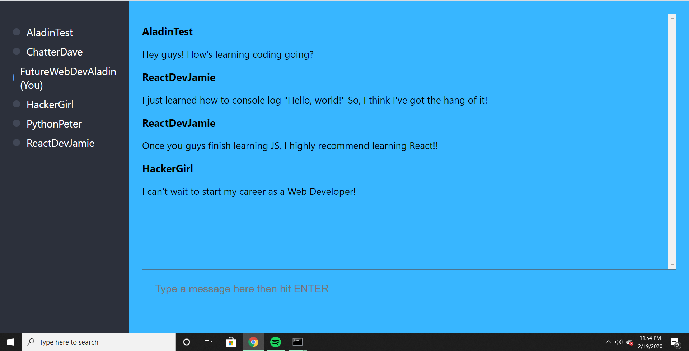

# Chatterbox
<h3>Full-stack chatroom app built using React (frontend) and Node / express (backend).</h3>

<h3>Key Features include: User Authentication, Identity Protection, Typing Indicator</h3>

<h3>Environment: JavaScript, React, Chatkit, Express, RESTful API.</h3>

