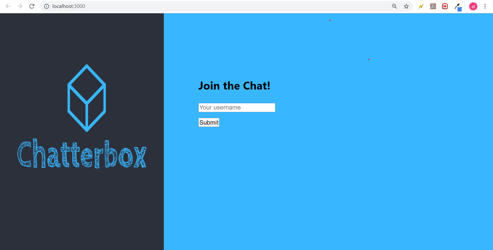

# Chatterbox
<h1>Full-stack chatroom app built using React (frontend) and Node / express (backend).</h1>

<h1>Key Features include: User Authentication, Identity Protection, Typing Indicator</h1>

<h1>Environment: JavaScript, React, Chatkit, Express, RESTful API.</h1>

